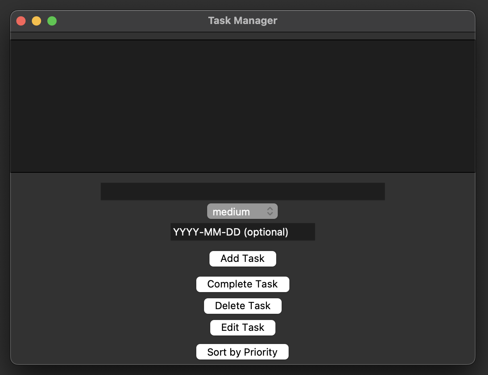

# 🗂️ Task Manager (Python + Tkinter)

A desktop task management application built in Python using Tkinter.  
Supports task creation, editing, prioritization, due dates, and overdue detection with persistent storage.

---

## ✨ Features

- Create, edit, complete, and delete tasks (full CRUD)
- Assign task priorities (Low / Medium / High)
- Add optional due dates
- Automatically flags overdue tasks
- Sort tasks by priority
- Persistent storage using CSV files
- Simple, clean GUI built with Tkinter

---

## 📸 Screenshots

### Main View


### Sorted by Priority


---

## 🛠️ Tech Stack

- Python 3
- Tkinter (GUI)
- CSV (data persistence)

---

## 🚀 How to Run

1. Clone the repository:
```bash
git clone https://github.com/helloren9/task-manager-gui.git
cd task-manager-gui